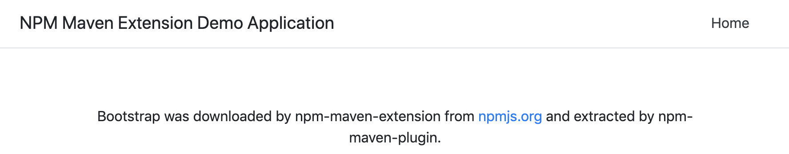

# npm-maven-extension

[](https://maven-badges.herokuapp.com/maven-central/com.github.szgabsz91/npm-maven-extension-parent)
[](https://circleci.com/gh/szgabsz91/workflows/npm-maven-extension)
[](https://github.com/szgabsz91/npm-maven-extension/blob/master/LICENSE)

This is an experimental project that demonstrates an alternative way of downloading NPM packages during a Maven build.

The most mainstream way of doing this would be to use [webjars](https://www.webjars.org/). This project contains another
way that I don't recommend using in production, but had much fun implementing it.

The main building blocks are the following:

* [npm-maven-extension](extension): downloads the NPM packages added to the pom.xml from an arbitrary NPM repository,
                                    with or without authentication. The downloaded tar.gz file will be stored in the
                                    local Maven repository.
* [npm-maven-plugin](plugin): during the Maven build,
                              the [extract](plugin/src/main/java/com/github/szgabsz91/maven/plugins/npm/ExtractMojo.java)
                              goal can extract the downloaded tar.gz file into an arbitrary, configurable folder. The
                              extracted resources can be referenced by your client web application.
* [npm-maven-extension-demo](demo): a Spring Boot demo application that contains a single HTML page that displays a
                                    Bootstrap based welcome page. Bootstrap is downloaded using the custom extension.

The site documentation of this project can be found on [Github Pages](https://szgabsz91.github.io/npm-maven-extension/introduction.html).

## Requirements

### settings.xml

The `~/.m2/settings.xml` file must at least contain an NPM server and a repository that uses *npm-http* or *npm-https*
as its protocol. The URL can point to the public npmjs.org server or any other private NPM repositories. The server node
can contain authentication information, too.

A sample settings.xml file looks like this: 

```xml
<?xml version="1.0" encoding="UTF-8"?>
<settings
    xmlns="http://maven.apache.org/SETTINGS/1.0.0"
    xmlns:xsi="http://www.w3.org/2001/XMLSchema-instance"
    xsi:schemaLocation="http://maven.apache.org/SETTINGS/1.0.0 https://maven.apache.org/xsd/settings-1.0.0.xsd">

    <servers>
        <server>
            <id>npm</id>
            <username>${optional_username}</username>
            <password>${optional_password}</password>
        </server>
    </servers>

    <profiles>
        <profile>
            <id>npm</id>
            <repositories>
                <repository>
                    <id>npm</id>
                    <url>npm-https://registry.npmjs.org</url>
                    <releases>
                        <updatePolicy>never</updatePolicy>
                        <checksumPolicy>ignore</checksumPolicy>
                    </releases>
                    <snapshots>
                        <updatePolicy>never</updatePolicy>
                        <checksumPolicy>ignore</checksumPolicy>
                    </snapshots>
                </repository>
            </repositories>
        </profile>
    </profiles>

    <activeProfiles>
        <activeProfile>npm</activeProfile>
    </activeProfiles>

</settings>
```

### pom.xml

In the pom.xml file of your client project, you must reference the NPM dependencies with the *npm* type property, and
define the extension, as well as the plugin.

A sample pom.xml file looks like this:

```xml
<?xml version="1.0" encoding="UTF-8"?>
<project
    xmlns="http://maven.apache.org/POM/4.0.0"
    xmlns:xsi="http://www.w3.org/2001/XMLSchema-instance"
    xsi:schemaLocation="http://maven.apache.org/POM/4.0.0 http://maven.apache.org/xsd/maven-4.0.0.xsd">

    <modelVersion>4.0.0</modelVersion>

    <groupId>com.demo</groupId>
    <artifactId>demo</artifactId>
    <version>1.0.0-SNAPSHOT</version>

    <properties>
        <bootstrap.version>5.2.3</bootstrap.version>
        <_angular_router.version>15.0.4</_angular_router.version>
        <npm-maven-extension.version>1.0.1</npm-maven-extension.version>
    </properties>

    <dependencies>
        <dependency>
            <groupId>npm</groupId>
            <artifactId>bootstrap</artifactId>
            <version>${bootstrap.version}</version>
            <type>npm</type>
        </dependency>
        <dependency>
            <groupId>npm</groupId>
            <artifactId>_angular_router</artifactId>
            <version>${_angular_router.version}</version>
            <type>npm</type>
        </dependency>
    </dependencies>

    <build>
        <extensions>
            <extension>
                <groupId>com.github.szgabsz91</groupId>
                <artifactId>npm-maven-extension</artifactId>
                <version>${npm-maven-extension.version}</version>
            </extension>
        </extensions>

        <plugins>
            <plugin>
                <groupId>com.github.szgabsz91</groupId>
                <artifactId>npm-maven-plugin</artifactId>
                <version>${npm-maven-extension.version}</version>
                <executions>
                    <execution>
                        <goals>
                            <goal>extract</goal>
                        </goals>
                    </execution>
                </executions>
                <configuration>
                    <outputFolder>${project.basedir}/src/main/resources/static/npm</outputFolder>
                </configuration>
            </plugin>
        </plugins>
    </build>

</project>
```

This project downloads [bootstrap@5.2.3](https://www.npmjs.com/package/bootstrap) and
[@angular/router@15.0.4](https://www.npmjs.com/package/@angular/router) into the `src/main/resources/static/npm` folder.

For a working example, see the [demo application](demo).

## Testing the Project

You can test the project with the following commands:

```bash
./mvnw clean site install
cd demo
./mvnw clean install
```

After that, if you open the `demo/src/main/resources/static/npm` folder, you'll see

* angular
    * router
        * package
            * ...
* bootstrap
    * package
        * ...

Also, you can build a Docker image from this simple war project and run it:

```bash
./mvnw clean install -Pdocker
docker run -p 8080:8080 npm-maven-extension-demo
```

After that, opening `http://localhost:8080/npm-maven-extension-demo`, you'll see a Bootstrap based welcome page:

<p align="center">
    
</p>
